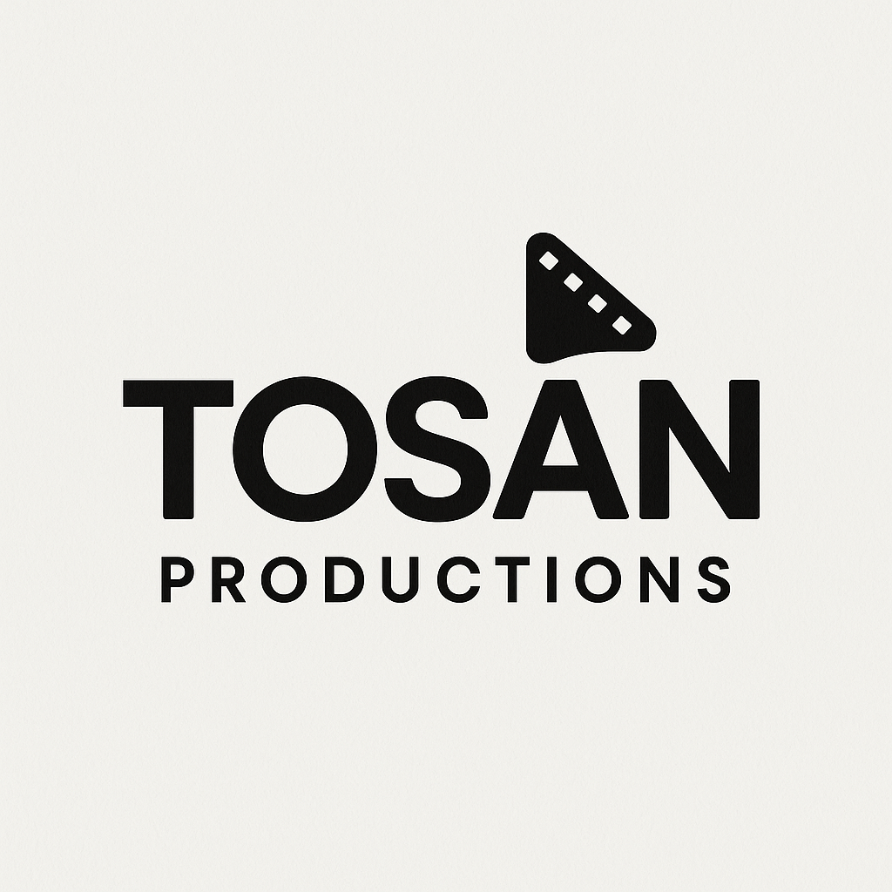

# TOSAN PRODUCTIONS - Portfolio Photographe



Portfolio professionnel de **Samuel Tosan**, photographe spécialisé en portraits, mariages, événements et photographie commerciale à Nivelles, Belgique.

## 🎯 À propos

Ce site web présente le travail de Samuel Tosan, photographe professionnel avec une expertise dans :
- **Portraits artistiques** - Capturer l'essence et l'émotion
- **Mariages** - Immortaliser les moments précieux
- **Événements** - Concerts, anniversaires, baptêmes
- **Photographie commerciale** - Restaurants, entreprises, produits

## ✨ Fonctionnalités

- 🖼️ **Galerie responsive** avec images optimisées WebP
- 📱 **Design mobile-first** parfaitement adaptatif
- ⚡ **Performance optimisée** avec lazy loading
- ♿ **Accessibilité complète** (WCAG 2.1 AA)
- 🔍 **SEO optimisé** avec sitemap et meta tags
- 🎨 **Interface moderne** avec animations fluides
- 📧 **Formulaire de contact** fonctionnel

## 🚀 Installation et développement

### Prérequis
- Node.js 18+ 
- npm 9+

### Installation
```bash
# Cloner le repository
git clone https://github.com/your-username/tosan-productions.git
cd tosan-productions

# Installer les dépendances
npm install

# Lancer le serveur de développement
npm run dev
```

### Scripts disponibles
```bash
npm run dev          # Serveur de développement avec hot reload
npm run build        # Build de production optimisé
npm run sass:watch   # Compilation SCSS en mode watch
npm run sass:build   # Compilation SCSS pour production
npm run test         # Tests de qualité (linting)
npm run clean        # Nettoyage des fichiers temporaires
```

## 📁 Structure du projet

```
tosan-productions/
├── assets/
│   ├── css/                 # CSS compilé
│   ├── images/              # Images optimisées
│   │   ├── photos/          # Photos des projets
│   │   └── ui/              # Éléments d'interface
│   ├── scripts/             # JavaScript modulaire
│   └── scss/                # Sources SCSS
│       ├── abstracts/       # Variables et mixins
│       ├── base/            # Styles de base
│       ├── components/      # Composants réutilisables
│       ├── layout/          # Structure de mise en page
│       ├── pages/           # Styles spécifiques aux pages
│       └── responsive/      # Media queries
├── pages/                   # Pages principales
├── projets/                 # Pages de projets individuels
├── index.html              # Page d'accueil
├── package.json            # Configuration npm
├── netlify.toml           # Configuration Netlify
├── robots.txt             # Configuration SEO
├── sitemap.xml            # Sitemap pour les moteurs de recherche
└── .htaccess              # Configuration Apache
```

## 🎨 Technologies utilisées

- **HTML5** - Structure sémantique
- **CSS3/SCSS** - Styles modulaires avec variables CSS
- **JavaScript ES6+** - Interactions et animations
- **Sass** - Préprocesseur CSS
- **Font Awesome** - Icônes
- **Fontshare** - Polices web optimisées

## 📱 Responsive Design

Le site est entièrement responsive avec des breakpoints optimisés :
- **Mobile** : < 768px
- **Tablet** : 768px - 1024px  
- **Desktop** : > 1024px

## ⚡ Optimisations de performance

- **Images WebP** avec fallback pour compatibilité
- **Lazy loading** des images
- **CSS/JS minifiés** en production
- **Compression Gzip** activée
- **Cache optimisé** (1 an pour les assets statiques)
- **Preload** des ressources critiques
- **Fonts optimisées** avec `font-display: swap`

## 🔒 Sécurité

- **Headers de sécurité** configurés
- **Content Security Policy** (CSP)
- **HTTPS** forcé en production
- **Protection XSS** et injection
- **Hotlinking** bloqué

## ♿ Accessibilité

- **WCAG 2.1 AA** conforme
- **Navigation clavier** complète
- **Screen readers** optimisés
- **Contrastes** vérifiés
- **Alt text** descriptif pour toutes les images
- **ARIA labels** et landmarks
- **Skip links** pour navigation rapide

## 🔍 SEO

- **Meta tags** optimisés
- **Open Graph** pour réseaux sociaux
- **Sitemap XML** automatique
- **Robots.txt** configuré
- **URLs propres** et descriptives
- **Structure HTML** sémantique
- **Schema.org** markup (si nécessaire)

## 🚀 Déploiement

### Netlify (recommandé)
1. Connecter le repository GitHub
2. Configuration automatique via `netlify.toml`
3. Déploiement automatique à chaque push

### Autres plateformes
Le site est compatible avec :
- Vercel
- GitHub Pages
- Surge.sh
- Tout hébergeur statique

## 📊 Analytics et monitoring

Recommandations pour le suivi :
- **Google Analytics 4** pour les statistiques
- **Google Search Console** pour le SEO
- **Lighthouse** pour la performance
- **WebPageTest** pour les tests de vitesse

## 🤝 Contribution

1. Fork le projet
2. Créer une branche feature (`git checkout -b feature/AmazingFeature`)
3. Commit les changements (`git commit -m 'Add AmazingFeature'`)
4. Push vers la branche (`git push origin feature/AmazingFeature`)
5. Ouvrir une Pull Request

## 📄 Licence

Ce projet est sous licence ISC. Voir le fichier `LICENSE` pour plus de détails.

## 📞 Contact

**Samuel Tosan** - Photographe professionnel
- 📧 Email : contact@tosanproductions.com
- 📱 WhatsApp : [Votre numéro]
- 📸 Instagram : [@votre-compte]
- 🌐 Site : https://tosanproductions.com

**Développement** - Thibaud.R
- 📧 Email : [votre-email]
- 🌐 Portfolio : [votre-portfolio]

---

⭐ Si ce projet vous plaît, n'hésitez pas à le star sur GitHub !